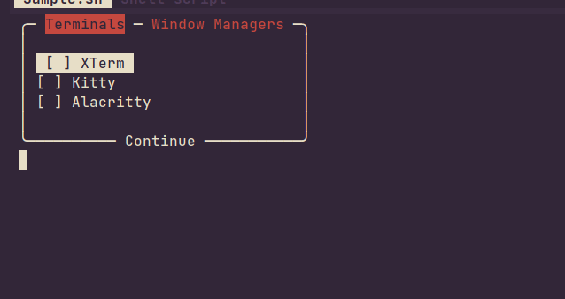

# Boxer
A script to become a professional boxer.
Add a UI to interactively select or deselect options for your scripts!


---

## Usage
Boxer only has one argument and that would be your choices.
The choices get seperated by a newline, so each line would be it's seperate
choice/tab. Boxer then outputs the chosen choices to stdout where you can
capture it using subshells. A full example can be found in [here](https://github.com/Smeueg/Boxer/blob/main/Boxer)

A short example would be:
```bash
opts="
== Terminals ==
XTerm
Kitty
Alacritty
== Window Managers ==
DWM
AwesomeWM
Qtile
"

Boxer "$opts"
```
In this example, there are two tabs. "Terminals" and "Window Managers". Inside
the "Terminals" tab, there are 3 options which are "Xterm", "Kitty", and
"Alacritty". Inside the "Window Managers" tab, there are also 3 options which
are "DWM", "AwesomeWM", and "Qtile". Say for example, the user picks "XTerm",
"Kitty", and "AwesomeWM" Boxer then outputs the chosen output to stdout with a
format similar to this:
```
== Terminals ==
XTerm
Kitty
== Window Managers ==
AwesomeWM
```
You can of course capture the output using a subshell (i.e. `$(Boxer "${opts}")`)
and parse them either using a `while read` loop or a `for` loop like so:
```bash
while read line; do
	case ${line} in
		"some string") echo "something" ;;
		"a different string") rm "some file" ;;
	esac
done <<EOF
$(Boxer "${opts}")
EOF
```
If you're using
a `for` loop, don't forget to set the "$IFS" to a newline.
