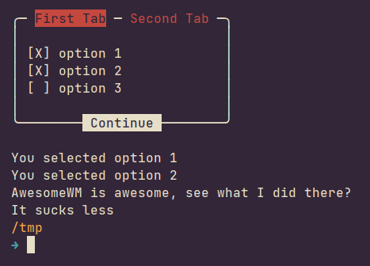

# Boxer
A script to become a professional boxer.
Add a UI to interactively select or deselect options for your scripts!




# Sample Usage
```bash
# Bootstrap / download 'Boxer'
if ! [ -f ./Boxer ]; then
	if command -v curl >/dev/null; then
		curl -L https://raw.githubusercontent.com/Smeueg/Boxer/main/Boxer -o Boxer
	elif command -v wget >/dev/null; then
		wget https://raw.githubusercontent.com/Smeueg/Boxer/main/Boxer -O Boxer
	else
		echo "Error: Can't download boxer"
		exit 1
	fi
fi


opts="
== First Tab ==
option 1
option 2
option 3
== Second Tab ==
AwesomeWM
DWM
Qtile
i3
"

run_opts() {
	for opt in ${opts}; do
		case "${opt}" in
			"option 1") echo "You selected option 1" ;;
			"option 2") echo "You selected option 2" ;;
			"option 3") echo "You selected option 3" ;;
			"AwesomeWM") echo "AwesomeWM is awesome, see what I did there?" ;;
			"DWM") echo "It sucks less" ;;
			"Qtile") echo "Woo Python!" ;;
			"i3") echo "Yeah i3 is pretty nice" ;;
		esac
	done
}

newline="
"

opts=$(./Boxer "${opts}")
IFS=${newline} run_opts
```
